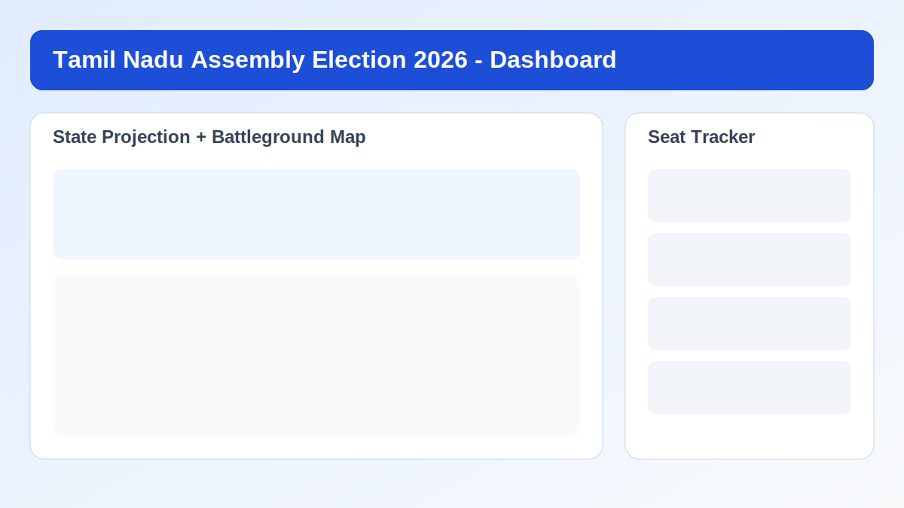
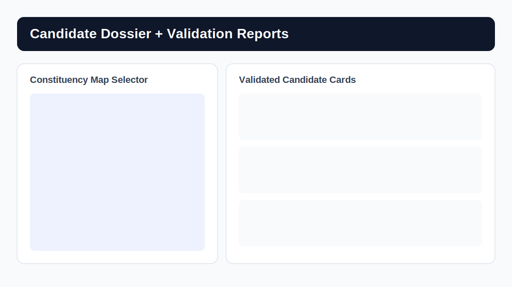
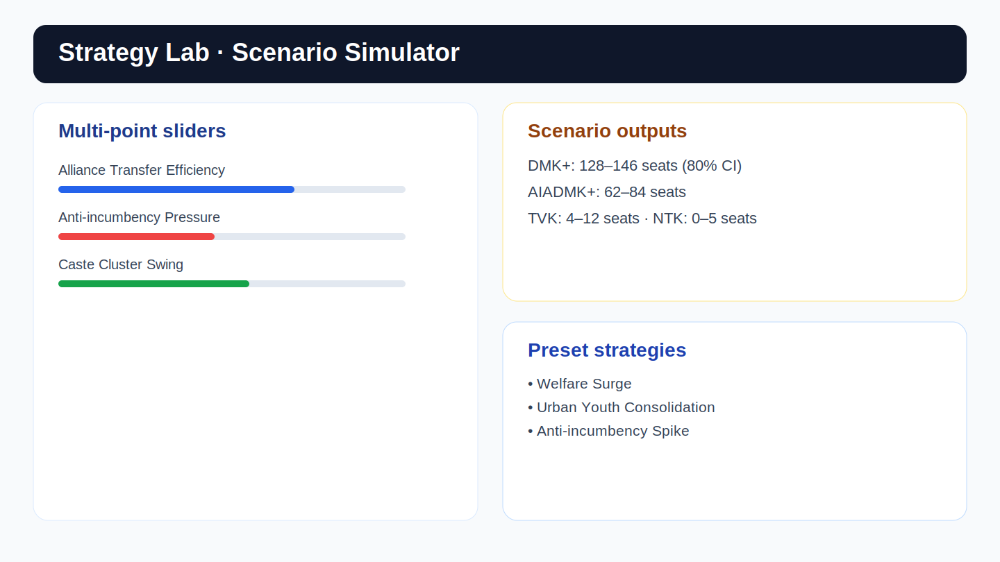
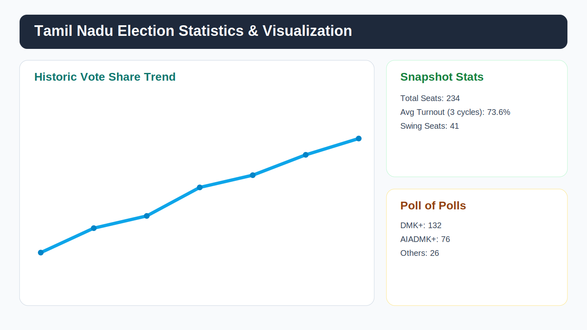

# Tamil Nadu Assembly Election Predictor 2026

Production-ready full-stack election analytics platform for Tamil Nadu (TN), with seat simulations, constituency deep-dives, candidate registry, opinion-poll synthesis, and historical/statistical visualizations.

Live app:
- Hugging Face Space: [kalilurrahman-tn-election-predictor.hf.space](https://kalilurrahman-tn-election-predictor.hf.space)
- GitHub repository: [kalilurrahman/tn-election-predictor](https://github.com/kalilurrahman/tn-election-predictor)

## Screenshots

### Dashboard


### Candidate Registry


### Strategy Lab


### Statistics & Visualization


## Product Summary

The app is structured across five model layers:

1. Data ingestion
- Pulls source data from election archives, curated reports, and polling/sentiment feeds.
- Includes source provenance utilities and sync presets.

2. Feature engineering
- Derives seat-level factors including alliance effects, trend/swing behavior, and constituency context.

3. Prediction engine
- Hybrid scoring pipeline combining priors, update signals, and sentiment-informed adjustments.

4. Forecasting and simulation
- Seat-by-seat outcomes, confidence bands, neck-and-neck detection, upset probabilities, and scenario simulation.

5. Analytics UI
- Interactive dashboard, map drill-down, candidate intelligence, strategy lab, poll-of-polls, and historical stats page.

## Core Pages

- Dashboard: State tally, battleground map, constituency cards, and quick prediction state.
- Candidate Registry: Candidate dossiers with incumbency/rerunner/celebrity tags, validation links, and constituency metadata.
- Strategy Lab: Multi-parameter what-if sliders and predefined strategy scenarios.
- Opinion Polls: Poll aggregation and trend-oriented poll-of-polls summary.
- Statistics & Visualization: Historical election records, turnout trends, and animated charts.

## PWA + Mobile Readiness

The app is configured as an installable Progressive Web App:
- `public/manifest.webmanifest` is configured with app identity and display mode.
- `public/sw.js` service worker is registered from `src/main.tsx`.
- Favicon and app icon links are wired in `index.html`.
- Responsive behavior includes mobile-safe navigation and fluid layout scaling for charts/maps/tables.

## Tech Stack

- Frontend: React 19, TypeScript, Vite, Tailwind CSS
- Backend: FastAPI, Uvicorn, Python analytics services
- Data/Model: Bayesian-style update flow, sentiment utilities, constituency simulation logic
- Deployment: GitHub + Hugging Face Docker Space (auto-deploy)

## API Surface (selected)

```txt
GET  /api/health
GET  /api/constituencies
GET  /api/predictions/summary
GET  /api/predictions/{ac_no}
GET  /api/neck-and-neck
GET  /api/surprises
GET  /api/elections/history
GET  /api/elections/community-split?ac_no={ac_no}
GET  /api/admin/candidate-sync/presets
GET  /api/admin/extract-checkin/latest
GET  /api/admin/extract-worker/status
POST /api/admin/extract-worker/run-once
POST /api/admin/extract-worker/start-daemon
POST /api/admin/trigger-update
POST /api/admin/clear-cache
```

## Background ECI/Extract Worker (Local + HF)

This project now includes a background extraction/check-in worker:
- Script: `backend/extract_checkin_worker.py`
- Output: `data/processed/latest_extract_checkin.json`
- Purpose: periodic extraction from configured sources and admin review checkpoint.

Run once (local):
```bash
python backend/extract_checkin_worker.py
```

Run as daemon (local):
```bash
EXTRACT_WORKER_MODE=daemon EXTRACT_INTERVAL_MINUTES=180 python backend/extract_checkin_worker.py
```

Auto-start inside API app (HF/local server):
- `ENABLE_EXTRACT_WORKER=true`
- `EXTRACT_INTERVAL_MINUTES=180`
- Configure source URLs:
  - `CANDIDATE_SOURCE_URLS=https://...csv,https://...json`
  - `ELECTION_RESULTS_SOURCE_URLS=https://...csv`

Admin check-in:
- Read latest extract summary: `/api/admin/extract-checkin/latest`
- Trigger manual run: `POST /api/admin/extract-worker/run-once`

## Local Run

```bash
# from tn-predictor-final/
npm install
pip install -r backend/requirements.txt
npm run build

# terminal 1
python -m uvicorn backend.main:app --reload --port 7860

# terminal 2
npm run dev
```

Frontend: `http://localhost:6001`  
Backend: `http://localhost:7860`

## Deployment Status

- Local: build/testable from the project directory.
- GitHub: synced to `master` branch in `kalilurrahman/tn-election-predictor`.
- Hugging Face: auto-deployed via GitHub Action to `kalilurrahman/tn-election-predictor` Space.

## Disclaimer

Built and curated by Kalilur Rahman: [kalilurrahman.lovable.app](https://kalilurrahman.lovable.app)

This platform is for informational and simulation purposes only. Forecasts are model-based estimates and real-world outcomes may differ.
